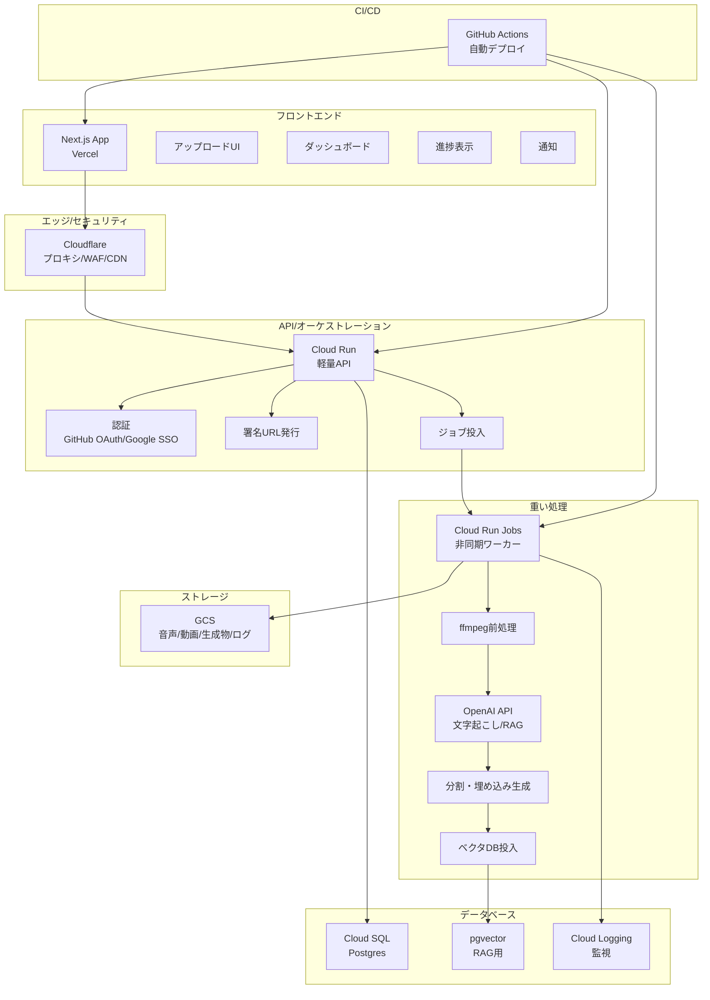

# Darwin システム構成

## 概要

Darwin プロジェクトは、講義録の自動生成とRAGシステムを提供するクラウドネイティブアプリケーションです。

## アーキテクチャ図

## コンポーネント詳細

### 1. フロントエンド（Vercel + Next.js）

#### 機能
- **アップロードUI**: ドラッグ&ドロップ、ファイル選択
- **ダッシュボード**: 講義録一覧、管理画面
- **進捗表示**: リアルタイム処理状況
- **通知**: WebSocket/SSE でのリアルタイム更新

#### 技術スタック
- **フレームワーク**: Next.js 14+
- **言語**: TypeScript
- **スタイリング**: Tailwind CSS
- **状態管理**: Zustand/Redux Toolkit
- **UI コンポーネント**: shadcn/ui

#### デプロイ
- **プラットフォーム**: Vercel
- **ドメイン**: `darwin.allianceforum.org`
- **CI/CD**: GitHub Actions による自動デプロイ

### 2. エッジ/セキュリティ（Cloudflare）

#### 機能
- **プロキシ**: リクエストルーティング
- **WAF**: セキュリティ保護
- **Bot対策**: 自動化された攻撃の防止
- **CDN**: 画像・PDFの高速配信

#### 設定
- **キャッシュ**: 静的アセット（画像、PDF）
- **セキュリティ**: DDoS保護、WAFルール
- **パフォーマンス**: 画像最適化

### 3. API/オーケストレーション（Cloud Run）

#### 機能
- **軽量API**: 認証、メタデータ管理
- **認証**: GitHub OAuth/Google SSO
- **署名URL発行**: セキュアなアップロード
- **ジョブ投入**: Pub/Sub/Cloud Tasks

#### 技術スタック
- **ランタイム**: Python 3.11+
- **フレームワーク**: FastAPI
- **認証**: Auth0/Google Identity
- **メッセージング**: Pub/Sub

#### スケーリング
- **最小インスタンス**: 0
- **最大インスタンス**: 10
- **CPU**: 1 vCPU
- **メモリ**: 512MB

### 4. 重い処理（Cloud Run Jobs）

#### 処理フロー
1. **大容量直アップロード**: Vercel → 署名URL → GCS
2. **ジョブ投入**: Pub/Sub/Cloud Tasks
3. **ffmpeg前処理**: 音声抽出・変換
4. **OpenAI API**: 文字起こし・RAG処理
5. **分割・埋め込み生成**: テキスト処理
6. **ベクタDB投入**: 知識ベース更新
7. **結果保存**: DB保存 + Webhook通知

#### 技術スタック
- **ランタイム**: Python 3.11+
- **音声処理**: FFmpeg
- **AI**: OpenAI API (gpt-4o-transcribe)
- **埋め込み**: OpenAI Embeddings
- **ベクタDB**: pgvector

#### リソース
- **CPU**: 2 vCPU
- **メモリ**: 4GB
- **タイムアウト**: 30分

### 5. ストレージ（GCS）

#### バケット構成
- **音声/動画**: 元ファイル保存
- **生成物**: 講義録・サマリー等
- **ログ**: 処理ログ・エラーログ

#### ライフサイクル管理
- **音声ファイル**: 30日後にアーカイブ
- **生成物**: 90日後にアーカイブ
- **ログ**: 7日後に削除

### 6. データベース

#### Cloud SQL (Postgres)
- **メタデータ**: 講義情報、ユーザー情報
- **権限管理**: アクセス制御
- **進捗管理**: 処理状況

#### pgvector
- **RAG**: ベクタ検索
- **埋め込み**: テキスト埋め込み
- **類似度検索**: コサイン類似度

#### 監視
- **Cloud Logging**: アプリケーションログ
- **Error Reporting**: エラー追跡
- **Ops Agent**: システム監視

### 7. CI/CD（GitHub Actions）

#### ワークフロー
- **テスト**: 自動テスト実行
- **セキュリティ**: 依存関係チェック
- **デプロイ**: Cloud Run & Vercel
- **通知**: Slack/Email

#### 環境
- **開発**: 自動デプロイ
- **ステージング**: 手動承認
- **本番**: 手動承認

## セキュリティ

### 認証・認可
- **OAuth 2.0**: GitHub/Google SSO
- **JWT**: トークンベース認証
- **RBAC**: ロールベースアクセス制御

### データ保護
- **暗号化**: 転送時・保存時
- **署名URL**: セキュアなアップロード
- **VPC**: プライベートネットワーク

### 監視・ログ
- **Cloud Logging**: 統合ログ管理
- **Error Reporting**: エラー追跡
- **Security Command Center**: セキュリティ監視

## パフォーマンス

### 最適化
- **CDN**: 静的アセット配信
- **キャッシュ**: Redis/Memcached
- **非同期処理**: バックグラウンドジョブ

### スケーリング
- **水平スケーリング**: 自動スケーリング
- **垂直スケーリング**: リソース調整
- **負荷分散**: ロードバランサー

## コスト最適化

### 料金構造
- **Vercel**: 使用量ベース
- **Cloud Run**: リクエストベース
- **GCS**: ストレージ・転送量
- **Cloud SQL**: インスタンス時間

### 最適化戦略
- **コールドスタート**: 最小インスタンス
- **ライフサイクル**: 自動アーカイブ
- **キャッシュ**: 重複処理回避

## 監視・運用

### メトリクス
- **可用性**: 99.9% SLA
- **レイテンシ**: 平均応答時間
- **エラー率**: 4xx/5xx エラー

### アラート
- **Slack**: 緊急アラート
- **Email**: 日次レポート
- **PagerDuty**: オンコール

## 開発・デプロイ

### 開発環境
- **ローカル**: Docker Compose
- **ステージング**: Cloud Run
- **本番**: Cloud Run

### デプロイ戦略
- **Blue-Green**: ゼロダウンタイム
- **カナリア**: 段階的リリース
- **ロールバック**: 自動復旧

## 今後の拡張

### 機能拡張
- **マルチモーダル**: 画像・動画対応
- **リアルタイム**: WebSocket通信
- **モバイル**: PWA対応

### 技術拡張
- **マイクロサービス**: サービス分割
- **イベント駆動**: Event Sourcing
- **CQRS**: コマンド・クエリ分離
